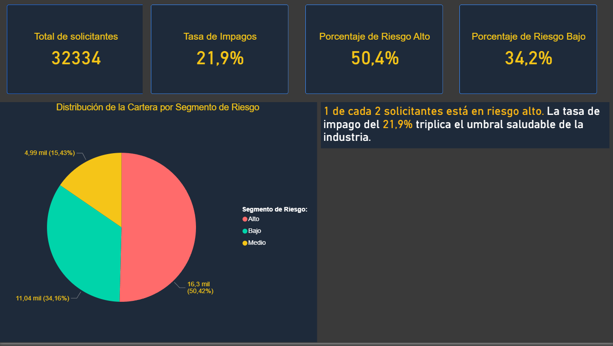
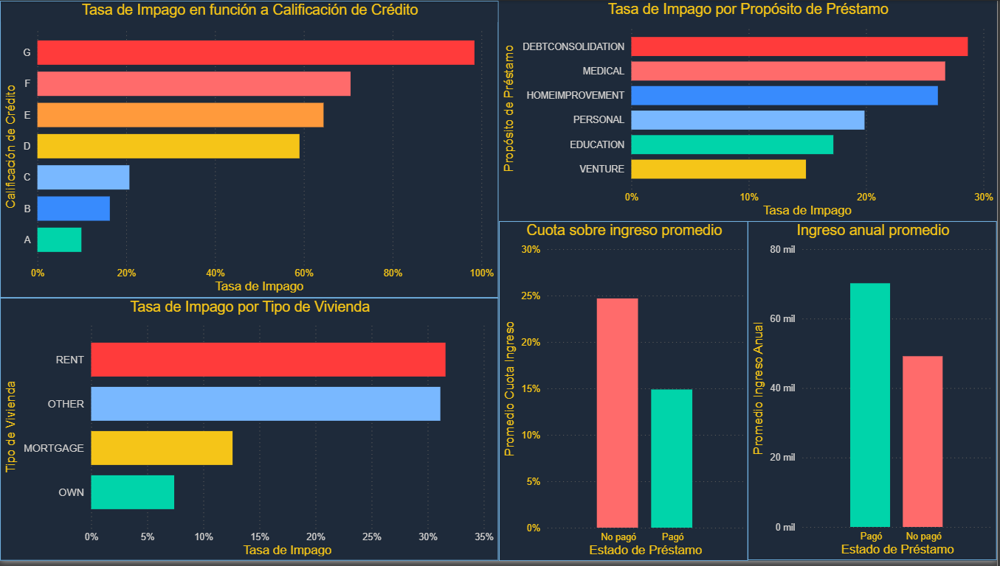
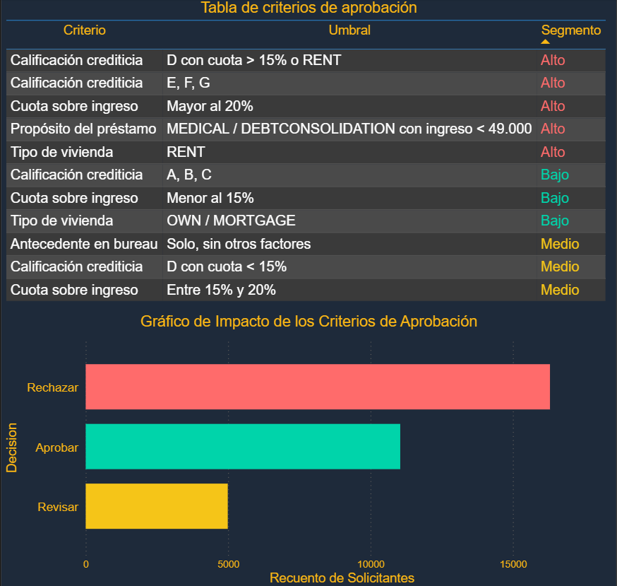

# Análisis de Riesgo Crediticio — LendSmart
 
> ¿Cómo puede una fintech de préstamos personales decidir a qué solicitantes aprobar, minimizando el riesgo de impago sin rechazar clientes con capacidad real de pago?
 
---
 
## 📌 Contexto y problema de negocio
 
**Empresa:** LendSmart — fintech argentina de préstamos personales (perfil simulado).
 
LendSmart está creciendo su base de solicitantes pero empieza a registrar una tasa de impago que supera el umbral aceptable. El equipo de riesgo necesita un sistema de análisis que les permita clasificar a los solicitantes por nivel de riesgo y tomar decisiones de aprobación más fundamentadas, reemplazando el criterio subjetivo actual por uno basado en datos.
 
**Destinatario del análisis:** Head of Risk o equipo de crédito de la fintech. No es una presentación técnica — es una recomendación de negocio respaldada por datos.
 
---
 
## 💡 Principales hallazgos
 
### KPI principal
 
De los 32.334 solicitantes analizados, **7.067 tuvieron impago — una tasa del 21,9%**.
 
Casi 1 de cada 4 préstamos termina sin cobrar. En la industria financiera una tasa saludable de impago para préstamos personales ronda el 3% al 8%, lo que indica que LendSmart está aprobando solicitantes sin los filtros de riesgo adecuados. Este análisis identifica qué variables explican ese riesgo y propone criterios de aprobación concretos para reducirlo.
 
---
 
### 1. La calificación D es el punto ciego del sistema
 
La calificación crediticia con mayor volumen de impagos no es la peor (G) sino la **D**. Las calificaciones E, F y G reciben menos aprobaciones porque el sistema ya las filtra con más cautela. La D queda en un punto intermedio — suficientemente aceptable para aprobarse masivamente, pero con un riesgo real que el sistema subestima.
 
> **Recomendación:** revisar los criterios de aprobación para solicitantes con calificación D, particularmente cuando se combinan con tipo de vivienda RENT o cuota sobre ingreso superior al 15%.
 
---
 
### 2. Los préstamos médicos y de consolidación de deuda concentran más riesgo
 
Los propósitos con mayor tasa de impago son **MEDICAL** y **DEBTCONSOLIDATION**, ambos superando el 20%. En los préstamos médicos el solicitante no eligió endeudarse — respondió a una urgencia, lo que sugiere que su situación financiera ya estaba comprometida antes de pedir. En la consolidación de deuda el patrón es similar: quien consolida deudas ya tiene dificultades previas de pago.
 
> **Recomendación:** aplicar criterios más estrictos para estos dos propósitos, especialmente en combinación con ingresos bajos o calificación D o inferior.
 
---
 
### 3. Los inquilinos concentran el mayor riesgo por tipo de vivienda
 
Los solicitantes con tipo de vivienda **RENT** tienen una tasa de impago del **73,1%** — muy por encima del resto. Un inquilino no tiene activo propio como respaldo, su situación financiera es más volátil y su capacidad de pago depende exclusivamente del ingreso mensual.
 
> **Recomendación:** para solicitantes con vivienda en alquiler, exigir un ratio cuota/ingreso menor al 15% antes de aprobar.
 
---
 
### 4. El historial del bureau no alcanza para predecir el riesgo
 
El **69,3% de los impagos proviene de solicitantes sin antecedentes negativos en el bureau**. La mayoría de los que no pagan no tenían señales de alerta previas — el historial crediticio solo no es suficiente para tomar decisiones de aprobación.
 
> **Recomendación:** complementar la consulta al bureau con variables de comportamiento financiero actual, como el ratio cuota/ingreso y el propósito del préstamo.
 
---
 
### 5. Hallazgos por variable numérica
 
| Variable | Pagaron | No pagaron | Diferencia |
|---|---|---|---|
| Ingreso anual promedio | $70.172 | $49.167 | -30% |
| Cuota sobre ingreso promedio | 14,9% | 24,7% | +65% |
| Tasa de interés promedio | 10,4% | 13,1% | +26% |
| Monto solicitado promedio | $9.245 | $10.869 | +18% |
| Edad promedio | 27,8 años | 27,5 años | Sin diferencia |
| Antigüedad laboral promedio | 4,97 años | 4,12 años | Sin diferencia |
 
El ingreso anual es la variable más discriminante del análisis — una brecha del 30% entre grupos confirma que la capacidad de pago es el predictor más directo del impago. La edad y la antigüedad laboral prácticamente no difieren entre grupos, lo que indica que no son variables relevantes para el modelo de aprobación.
 
El ratio cuota/ingreso es el segundo criterio más importante: los que no pagan destinan en promedio el 24,7% de su ingreso a la cuota, casi el doble del 14,9% de los que sí pagan.
 
---
 
## ✅ Criterios de aprobación sugeridos
 
| Criterio | Umbral sugerido | Segmento |
|---|---|---|
| Cuota sobre ingreso | Menor al 15% | Bajo |
| Cuota sobre ingreso | Entre 15% y 20% | Medio |
| Cuota sobre ingreso | Mayor al 20% | Alto |
| Calificación crediticia | A, B, C | Bajo |
| Calificación crediticia | D con cuota < 15% | Medio |
| Calificación crediticia | D con cuota > 15% o RENT | Alto |
| Calificación crediticia | E, F, G | Alto |
| Tipo de vivienda | OWN / MORTGAGE | Bajo |
| Tipo de vivienda | RENT | Alto |
| Propósito del préstamo | MEDICAL / DEBTCONSOLIDATION con ingreso < $49.000 | Alto |
| Antecedente en bureau | Solo, sin otros factores | Medio |
 
Aplicando estos criterios, LendSmart debería rechazar el **50,4%** de los solicitantes actuales y revisar un **15,4%** adicional. Solo el **34,2%** de la cartera cumple condiciones de riesgo bajo.
 
---
 
## 📊 Dashboard — Power BI
 
El dashboard está dividido en tres páginas, cada una orientada a responder una pregunta de negocio específica.
 
### Página 1 — Visión general de la cartera
Vista ejecutiva del estado actual de LendSmart. Responde: **¿cuál es la magnitud del problema de impago y cómo se distribuye el riesgo en la cartera?**
 

 
### Página 2 — Perfil del solicitante riesgoso
Análisis de las variables más asociadas al impago por categoría y comparación de promedios entre grupos. Responde: **¿quién no paga y qué tienen en común?**
 

 
### Página 3 — Criterios de decisión
Tabla de aprobación con semáforo de riesgo y gráfico de impacto
 

 

### Recomendación accionable. Responde: **¿a quién aprobar y bajo qué condiciones?
Aplicando los criterios definidos, LendSmart debería rechazar el 50,4% de los solicitantes actuales y revisar un 15,4% adicional antes de aprobar. Solo el 34,2% de la cartera cumple condiciones de riesgo bajo.
Las tres variables con mayor poder de discriminación son la cuota sobre ingreso, el tipo de vivienda y la calificación crediticia. Ningún solicitante con cuota superior al 20% del ingreso, vivienda en alquiler o calificación E, F o G debería aprobarse sin un análisis adicional.
Implementar estos filtros reduciría la tasa de impago actual del 21,9% a niveles más cercanos al umbral saludable de la industria.

---
 
## ⚙️ Pipeline de datos
 
| Etapa | Herramienta | Descripción |
|---|---|---|
| Carga del dataset | Python (Pandas + SQLAlchemy) | Ingesta del CSV a MySQL |
| Exploración y limpieza | SQL (MySQL) | EDA, tratamiento de nulos y outliers |
| Segmentación de riesgo | SQL (MySQL) | Clasificación de solicitantes en Alto / Medio / Bajo |
| Visualización | Power BI | Dashboard interactivo de tres páginas |
 
### Decisiones de limpieza
 
El dataset original presentó los siguientes casos que requirieron criterio analítico:
 
- **Duplicados:** eliminados antes del análisis.
- **Nulos en `tasa_interes`** (3.028 registros): imputados con el promedio de tasa por `calificacion_credito`, dado que esa variable es el principal determinante de la tasa. Se eligió imputar en vez de eliminar porque representaban el 9,3% del dataset.
- **Nulos en `antiguedad_laboral`** (820 registros): conservados como nulos. No hay forma confiable de imputar antigüedad laboral y representan menos del 3% del dataset.
- **Outliers eliminados:** registros con edad mayor a 100 años, antigüedad laboral mayor a 60 años e ingresos superiores a $1.000.000.
---
 
## 🛠️ Stack utilizado
 
| Herramienta | Rol en el proyecto |
|---|---|
| Python (Pandas, SQLAlchemy) | Ingesta del dataset a MySQL |
| MySQL | EDA, limpieza, transformación y segmentación |
| Power BI | Dashboard interactivo final |
 
---
 
## 📦 Dataset
 
**Fuente:** [Credit Risk Dataset — Kaggle](https://www.kaggle.com/datasets/laotse/credit-risk-dataset)
 
Dataset que simula datos reales de bureau de crédito, con variables del tipo que utilizan los equipos de riesgo en la industria financiera. Contiene registros de solicitantes con información demográfica, características del préstamo solicitado e historial crediticio.
 
---
 
## 👤 Autor
 
Desarrollado por **Matías Bustamante**
Analista de Datos | Estudiante de Programación
Diplomatura en Gestión y Análisis de Datos — UBA
 

